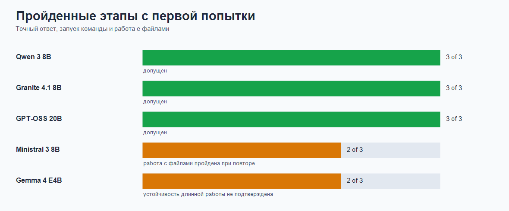
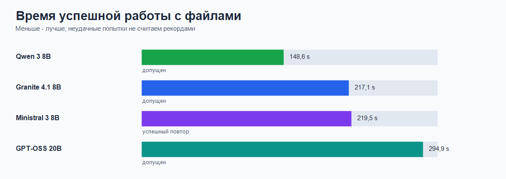

# Проверка местных моделей для работы с кодом

Здесь собран практический ответ на простой вопрос: какую модель можно запускать
на одном компьютере с Windows 11 и Radeon RX 6800, чтобы Claude Code не только
отвечал, но и действительно работал с файлами.

## Короткий ответ

Для основной очереди остаётся `qwen3:8b-q4_K_M-ctx40k`.

В следующий круг проходят пять профилей. Два необычных новичка тоже нашли своё
место: `ministral-3:8b-ctx32k` прошёл со второй попытки, а
`gpt-oss:20b-ctx32k` прошёл все ступени сразу. Последний крупнее и медленнее,
зато честно работает с файлами и целиком помещается в видеопамять.

## Как мы сюда пришли

Размер модели говорит не всё. Важно ещё рабочее окно: слишком большое окно
съедает память, и часть работы переезжает в обычную память компьютера. После
этого скорость начинает гулять. Поэтому у каждой модели своя настройка.

| Модель | Рабочее окно | Размещение | Итог |
|---|---:|---|---|
| `qwen3:8b-q4_K_M-ctx40k` | `40960` | `100% GPU` | Основной кандидат |
| `granite4.1:8b-ctx32k` | `32768` | `100% GPU` | Надёжный запасной кандидат |
| `gemma4:e4b-ctx128k` | `131072` | `100% GPU` | Для ограниченных задач; длинная работа требует повтора |
| `ministral-3:8b-ctx32k` | `32768` | `100% GPU` | Новый кандидат; следим за повторяемостью |
| `gpt-oss:20b-ctx32k` | `32768` | `100% GPU` | Новый тяжёлый кандидат |

`GPU` означает видеокарту. Правило строгое: если модель начинает выгружаться в
обычную память, в следующий круг она не проходит.

## Два новичка

### Ministral 3 8B

Почему взяли: свежая модель для работы рядом с пользователем. В каталоге Ollama
у семейства около `1.1M` загрузок.

| Этап | Время | Итог |
|---|---:|---|
| Точный ответ | `43.4` с | Пройден |
| Запуск команды | `78.2` с | Пройден |
| Работа с файлами, первая попытка | `206.7` с | Пропущено чтение `CHANGELOG.md` |
| Работа с файлами, повтор | `219.5` с | Пройден полностью |

Модель умеет читать файлы, создавать файл, запускать команды и проверять
состояние Git. Сначала поспешила, затем собралась и сделала всё по списку.

### GPT-OSS 20B

Почему взяли: это необычная смесь экспертов в компактном формате `MXFP4`.
Ollama прямо рекомендует семейство для Claude Code; в каталоге около `9.7M`
загрузок.

| Этап | Время | Итог |
|---|---:|---|
| Точный ответ | `52.6` с | Пройден |
| Запуск команды | `43.8` с | Пройден |
| Работа с файлами | `294.9` с | Пройден |

На RX 6800 профиль занимает `14` ГБ и остаётся на `100% GPU`: все `25/25`
слоёв размещены в видеопамяти. Модель не спринтер, но финиш видит.

## Кто быстрее в сложной работе

Сравниваем только успешные проходы работы с файлами. Провал за три секунды не
является рекордом скорости, как бы заманчиво это ни выглядело.

`qwen3:8b-q4_K_M-ctx40k` остаётся самым ровным выбором. Granite медленнее, зато
предсказуем. Ministral заслужил место в очереди с пометкой о повторе. GPT-OSS
занимает почти всю видеопамять и работает медленнее, но даёт полезную пятую
точку сравнения.

## Кто пока не прошёл

`nemotron-3-nano:4b-ctx32k` занимал всего `5.7` ГБ и оставался на `100% GPU`,
но трижды не понял задачу Claude Code. Экономия памяти прекрасна, однако
отвёртка всё-таки должна крутить винты. Поэтому на графиках его нет.

## Что делать дальше

1. Прогнать пять профилей на небольшом наборе задач с тестами.
2. Для Ministral считать долю успешных повторов, а не один красивый проход.
3. Для Gemma отдельно разобрать остановку после первого чтения файла.
4. Сравнивать GPT-OSS с Qwen по качеству результата: за лишние минуты хочется
   получать не философию, а исправленный код.

## Где лежат подробности

- [Стратегия проверки](docs/specs/coder-model-benchmark-strategy.md)
- [Порядок запуска](docs/runbooks/coder-model-evaluation.md)
- [Подбор рабочего окна](docs/runbooks/runs/2026-06-01-favorite-model-ctx-sweep.md)
- [Проверка GPT-OSS 20B](docs/runbooks/runs/2026-06-02-gpt-oss-20b-ctx32k-full-gpu-gate.md)
- Сырые результаты GPT-OSS:
  `.artifacts/claude-ollama-headless/20260602T041314/` и
  `.artifacts/claude-ollama-headless/20260602T041411/`

Источники по новым моделям:

- [Ministral 3 в Ollama](https://ollama.com/library/ministral-3)
- [Nemotron 3 Nano в Ollama](https://ollama.com/library/nemotron-3-nano)
- [GPT-OSS в Ollama](https://ollama.com/library/gpt-oss)
- [Рекомендации Ollama для Claude Code](https://ollama.com/blog/launch)
