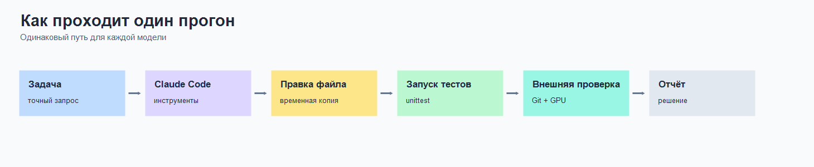
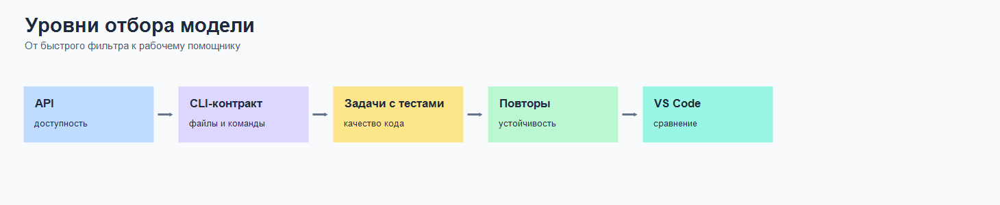
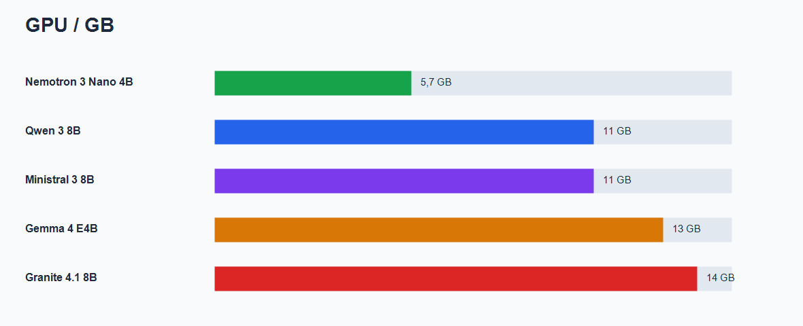
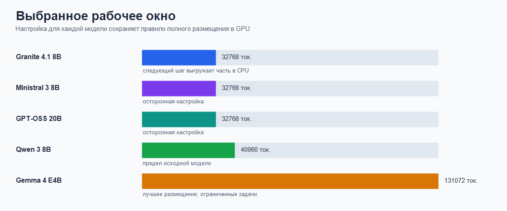
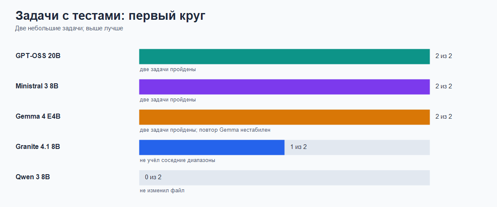

# Локальные модели для Claude Code: практическая проверка на Radeon RX 6800

## Для чего нужен этот проект

Этот проект помогает выбрать локальную модель для работы с кодом через Claude
Code и Ollama. Проверяется не умение поддержать разговор, а способность
прочитать файлы, внести правку, запустить команду и честно сообщить результат.

Стенд собран на одном компьютере: Windows 11, Claude Code CLI, Claude Code для
VS Code, Ollama и AMD Radeon RX 6800 с `16` ГБ видеопамяти. Основной путь
проверки автоматический и безголовый. VS Code остаётся отдельным сравнением.

## Схема проверки

Для каждой модели создаётся отдельная временная копия задачи. Claude Code
получает одинаковый запрос, использует инструменты и запускает тесты. Затем
отдельный скрипт ещё раз проверяет код. Это важная деталь: уверенный ответ
модели сам по себе не считается доказательством.



Проверка идёт слоями. Сначала отсеиваются недоступные модели и модели без
рабочих инструментов. Затем измеряются качество кода и повторяемость. Только
после этого имеет смысл сравнивать поведение в VS Code.



## Условия стенда

В дальнейший отбор проходят только профили, которые полностью помещаются в
видеопамять. Если Ollama показывает выгрузку в обычную память, модель
откладывается: на одном RX 6800 такой режим слишком сильно меняет скорость.

| Модель | Рабочее окно | Размещение | Статус |
|---|---:|---|---|
| `qwen3:8b-q4_K_M-ctx40k` | `40960` | `100% GPU` | Контрольный профиль |
| `granite4.1:8b-ctx32k` | `32768` | `100% GPU` | Допущен |
| `gemma4:e4b-ctx128k` | `131072` | `100% GPU` | Допущен с оговоркой о повторяемости |
| `ministral-3:8b-ctx32k` | `32768` | `100% GPU` | Допущен |
| `gpt-oss:20b-ctx32k` | `32768` | `100% GPU` | Допущен |





## Первый набор задач

Первый набор намеренно небольшой. Он не заменяет большой сравнительный тест,
но быстро показывает, умеет ли модель довести правку до работающего состояния.

### Задача 1. Нормализация меток

Нужно реализовать функцию `normalize_tags(tags)`: очистить пробелы, привести
строки к нижнему регистру, убрать пустые значения и повторы, сохранив порядок.

Пример:

```python
normalize_tags([" Python ", "OLLAMA", "python", "", "  Git  "])
# ["python", "ollama", "git"]
```

Дополнительные тесты проверяют пустой список и ошибки типов.

### Задача 2. Объединение диапазонов

Нужно исправить `merge_ranges(intervals)`: отсортировать диапазоны, объединить
пересечения и соседние диапазоны, не изменяя исходный список.

Пример:

```python
merge_ranges([[1, 2], [3, 4], [8, 9]])
# [[1, 4], [8, 9]]
```

Дополнительные тесты проверяют порядок входа, пустой список и неверные
диапазоны.

## Один показательный ход рассуждения

В артефакте `gpt-oss:20b-ctx32k` для второй задачи есть хороший пример
прикладного рассуждения. Модель заметила, что одной замены условия недостаточно:

1. Вход может быть не отсортирован, поэтому нужна отсортированная копия.
2. Нельзя менять исходный список.
3. Соседние целочисленные диапазоны требуют условия `start <= previous_end + 1`.
4. До объединения нужно проверить форму диапазона и порядок границ.

После этого модель внесла правку и получила `6/6` успешных тестов. Итоговый код:

```python
def merge_ranges(intervals):
    """Return sorted intervals with overlaps and touching ranges merged."""
    if not intervals:
        return []

    sorted_intervals = sorted(intervals, key=lambda x: x[0])
    merged = []
    for interval in sorted_intervals:
        if not isinstance(interval, (list, tuple)) or len(interval) != 2:
            raise ValueError("Each interval must contain exactly two numbers")
        start, end = interval
        if not isinstance(start, (int, float)) or not isinstance(end, (int, float)):
            raise ValueError("Interval bounds must be numbers")
        if start > end:
            raise ValueError("Interval start must not exceed end")

        if merged and start <= merged[-1][1] + 1:
            merged[-1][1] = max(merged[-1][1], end)
        else:
            merged.append([start, end])
    return merged
```

Это небольшой пример, но в нём видна разница между механической заменой строки
и разбором требований.

## Результаты первого круга

| Модель | Пройдено | Время двух ответов | Наблюдение |
|---|---:|---:|---|
| `gpt-oss:20b-ctx32k` | `2/2` | `293.8` с | Обе задачи решены |
| `ministral-3:8b-ctx32k` | `2/2` | `817.7` с | Обе задачи решены, но медленнее |
| `gemma4:e4b-ctx128k` | `2/2` | `298.3` с | Отдельный повтор простой задачи не прошёл |
| `granite4.1:8b-ctx32k` | `1/2` | `374.3` с | Не объединены соседние диапазоны |
| `qwen3:8b-q4_K_M-ctx40k` | `0/2` | `1253.0` с | Первая правка не применена, вторая неполна |



Время пока считается ориентиром. Например, повтор простой задачи у GPT-OSS
занял `720.7` с вместо `133.8` с в первом круге. Для честного сравнения нужны
серии запусков, а не один особенно бодрый вторник.

## Ограничения текущего результата

Первый набор измеряет качество правки кода, но ещё не закрывает полный контракт
агента. В запросах заранее назван нужный файл. Следующий этап должен проверить
самостоятельный поиск файла, повторяемость и точность итогового ответа.

Отдельно проверен `nemotron-3-nano:4b-ctx32k`: он занимает всего `5.7` ГБ и
остаётся на `100% GPU`, но не выполняет задания Claude Code. Поэтому в
сравнительные графики рабочих профилей он не включён.

## Промежуточный вывод

На текущем стенде основной кандидат для следующего этапа:
`gpt-oss:20b-ctx32k`. Он полностью помещается в видеопамять и прошёл обе
задачи с внешней проверкой тестами.

Вторым кандидатом остаётся `ministral-3:8b-ctx32k`. Gemma показывает полезные
способности, но требует проверки повторяемости. Granite и Qwen пока разумнее
оставить контрольными профилями.

Следующий шаг: полный CLI-сценарий для GPT-OSS и Ministral без подсказки имени
файла, затем по три повтора задач для оценки устойчивости.

## Подробности и источники

- [План следующих этапов](docs/plans/vscode-ollama-agent-plan.md)
- [Контракт проверки](docs/contracts/vscode-ollama-agent-contract.md)
- [Стратегия оценки](docs/specs/coder-model-benchmark-strategy.md)
- [Первый круг задач с тестами](docs/runbooks/runs/2026-06-02-coder-fixture-first-pass.md)
- [Проверка GPT-OSS 20B](docs/runbooks/runs/2026-06-02-gpt-oss-20b-ctx32k-full-gpu-gate.md)
- [Ministral 3 в Ollama](https://ollama.com/library/ministral-3)
- [Nemotron 3 Nano в Ollama](https://ollama.com/library/nemotron-3-nano)
- [GPT-OSS в Ollama](https://ollama.com/library/gpt-oss)
- [Рекомендации Ollama для Claude Code](https://ollama.com/blog/launch)
